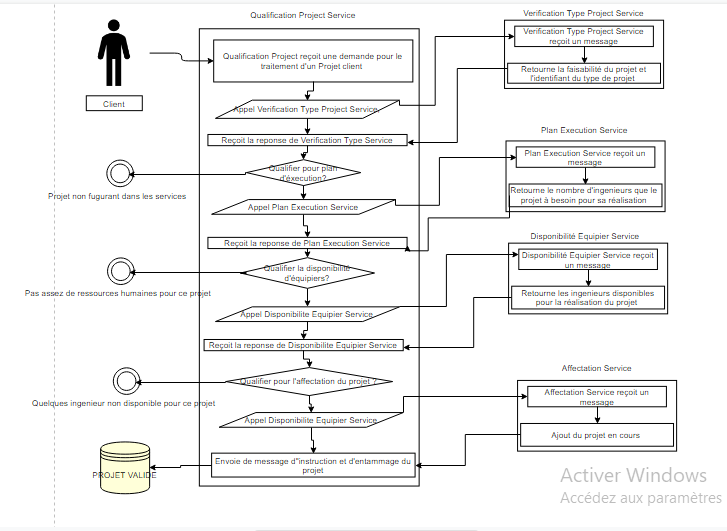

# ServicesOrientedArchitechtureProject
Projet académique du module Architectures orientées objets (SOA) en Master 2 DATASCALE à l'université de Versailles Saint Quentin En Yvelines, encadré par Mr Taher Yehia.

### Sujet de projet
Le projet parle initialement sur une entreprise qui fournis des services dans le monde de l'informatique, avec 8 équipes differentes qui s'enchargent à realiser les differents projets du client sur ces 8 types du projets.  
Le sujet de projet se situe ici: [SOAsujet.pdf](./Docs/SOAsujet.pdf).
 
### Diagramme Uml 
Apres l'interprétation du sujet, on se retrouve à établir un diagramme UML suivant pour les differents services proposés pour 
la societé ArtIntell de sujet du projet, avec les differents flux existants entre les clients et les services.

 
### Cahier de charges du projet
Pour plus d'informations sur ce projet, que çà soit sur coté conception et choix de services, tout est expliqué en details dans ce cahier de charges.
Je vous invites à le lire [SOA.pdf](./Docs/SOA.pdf) 

Et vous en trouvez une petite manipulation sur les differents fichiers WSDL sur l'outil SoapUI.

#### Fichiers Joints
Vous trouverez ici les fichiers joints, soit en java qui ont permis d'avoir les fichiers WSDL en passant par Axis2 de apache pour les transformés en services web, et en executable (.wsdl) pour SoapUI.
[Java Files](./Java%20Source%20Files) 
[Wsdl Files](./WSDL%20Files) 